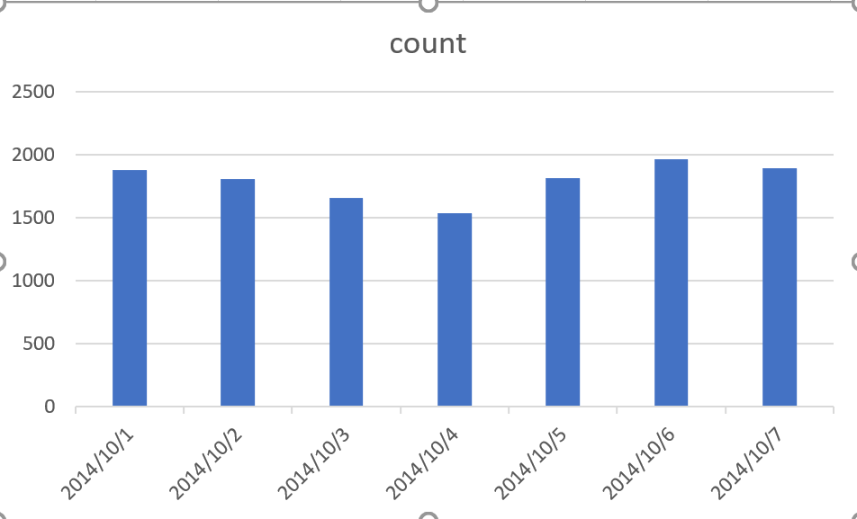
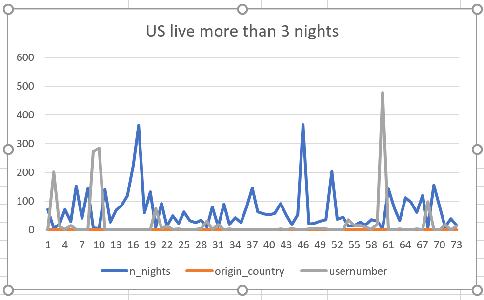
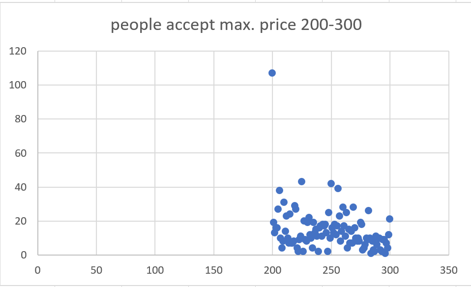
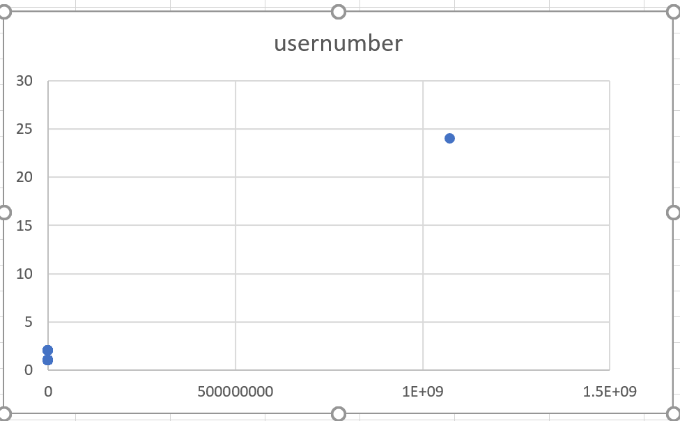
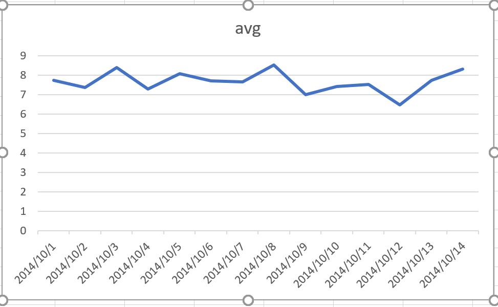

## ica4

## Question 1
How many people search for a host on Airbnb every day during first week 2014?

```sql
select 
ds,
count (Distinct id_user) as count
From strata_user.airbnb_sq
where ds>='2014-10-01'and ds<='2014-10-07'
group by ds
```




## Question 2
How many people from US are going to live more than 3 nights?

```sql
select 
n_nights, origin_country,
count(id_user) as usernumber
from strata_user.airbnb_sq
where n_nights > 3 AND origin_country='US'
group by 1,2
```





## Question 3
How many people could accept the max. price between 200 and 300?

```sql
SELECT
filter_price_max,
count(*)
from strata_user.airbnb_sq
where filter_price_max <=300  and  filter_price_max >=200
group by filter_price_max
order by filter_price_max DESC
```



## Question 4
How many people filter room type for private room and could accept the max. price over 300?

```sql
select 
filter_room_types,filter_price_max,
count(id_user) as usernumber
from datasets.airbnb_searches
where filter_room_types='Private room'and filter_price_max > 300
group by 1,2
```



## Question 5
What origin country have been choosing most?

```sql
SELECT
ds,
avg(n_nights)
from strata_user.airbnb_sq
group by ds
order by ds ASC
```




